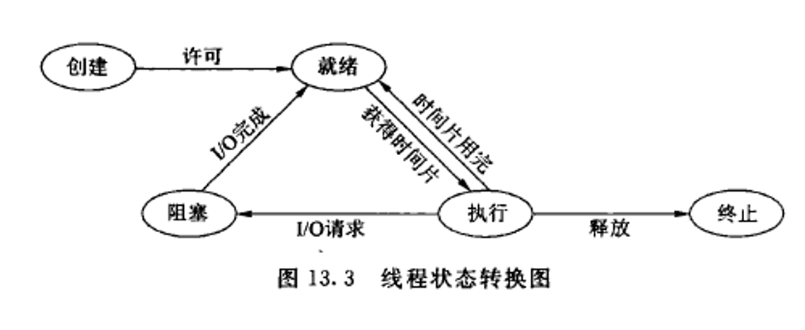

# Process & Thread

## Process

A process is an instance of a computer program that is being executed. It contains the program code and its current activity. **Each process in an operating system has its own memory block and is incapable of accessing the memory of another process unless they both agree to share information.** This prevents a bug or crash in one process from affecting others. Processes can also be scheduled by the operating system, allowing for concurrent execution on a single machine, or parallel execution on a machine with multiple processors or cores.

Here are some of the key features and characteristics of processes in an operating system:

1. **Process Isolation:** Each process operates independently of others, and cannot directly access the memory of another process. This ensures that a fault in one process does not affect other processes. This isolation also provides a security feature, preventing unauthorized access to another process's memory.

2. **Process Hierarchy:** Processes can create other processes, forming a parent-child relationship. The parent process can control its child processes, and information can be passed between parent and child.

3. **Process States:** A process can be in one of several states, including running (currently being executed), ready (ready to be executed when the CPU is available), and blocked (waiting for an event such as an I/O operation to complete).

4. **Concurrency:** Multiple processes can be executed concurrently, either through multitasking on a single processor (where the CPU switches rapidly between processes) or through parallel execution on multiple processors or cores.

5. **Resource Ownership:** Each process owns and manages its resources like memory, files, and I/O devices. When a process terminates, the operating system can reclaim these resources.

6. **Communication:** Processes can communicate with each other through several mechanisms provided by the operating system, including **pipes, message queues, shared memory, and sockets.**

7. **Context Switching:** The operating system can switch the CPU from one process to another, a procedure known as a context switch. This involves **saving the state of the old process and loading the saved state of the new process.**

8. **Persistence:** While a process is running, it remains in memory. When it finishes execution, it is removed from memory and its resources are freed for use by other processes.

9. **Scheduling:** The operating system manages when and how long each process runs in a part of the system called the scheduler. This can be based on priority, the need for resources, or other factors.

## Thread

A thread is a unit of execution within a process. A process can have multiple threads. Unlike processes, threads within the same process can access the same memory space, which makes inter-thread communication easier than inter-process communication. **Threads within the same process share resources such as memory, file handles, and more, but each thread has its own set of registers , heap and stack.**

Threads share many similarities with processes but have some unique features as well:

1. **Shared Memory Space:** All threads within a process share the same memory space, which means they can access the same variables and data structures. This can make communication between threads much faster and more straightforward than inter-process communication.

2. **Thread States:** Similar to processes, threads have different states like running, ready, and blocked (or waiting). However, a new state called "new" is also there when a thread is created but not yet started.

3. **Lightweight:** Threads are often referred to as lightweight processes. This is because **creating, destroying, and switching between threads is generally faster than with processes, since threads within the same process share resources.**

4. **Concurrency within a Process:** A multithreaded process can perform multiple tasks concurrently, which can lead to more efficient use of processor time and improved performance, particularly on systems with multiple processors or cores.

5. **Thread-specific data:** Even though threads share the same memory space, they also have their own private data, including **thread-local variables and a unique program counter.**

6. **Dependent Life Cycle:** The life cycle of a thread is dependent on the process it belongs to. When a process is terminated, all of its threads are also terminated.

7. **Efficient Communication:** Since threads share memory with their parent process, communication between threads can be very efficient. They can write to shared variables and data structures, without using more complex inter-process communication methods.

8. **Context Switching:** Context switching between threads of the same process is less expensive than between processes. This is because threads share the same address space and have shared access to the process's resources.

Please note that while these are generally common characteristics of threads, the actual implementation and behavior can vary depending on the specific operating system and programming language.

## Conclusion

In summary:

- A process is the highest level of encapsulation in an operating system, containing its own memory space and system resources.
- A thread is a lower level of encapsulation within a process, all threads within a process share the same memory space, but have their own registers and stack.
- Both processes and threads can be scheduled by the operating system, and they both allow for concurrent or parallel execution of tasks.

It's also worth noting that multithreaded programming can be complex, as threads may compete for resources or need to synchronize their actions, which can lead to subtle bugs if not handled correctly. Nevertheless, multithreading can be a powerful tool for improving performance in certain types of applications, particularly those that are I/O-bound or that can be easily parallelized.